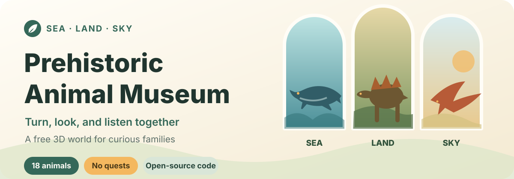
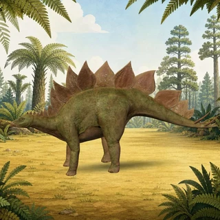

<p align="center">
  
</p>

<p align="center">
  <strong>For curious children and the grown-ups willing to sit beside them.</strong><br>
  Turn a model to examine plates, teeth, and wings, then play a short Mandarin introduction when you want to listen.
</p>

<p align="center">
  <strong><a href="https://s010s.github.io/prehistoric-animal-museum/">Open the museum →</a></strong>
  · <strong>English</strong>
  · <a href="README.zh-CN.md">简体中文</a>
</p>

<p align="center">Open in a browser · No account · No ads · No analytics · Free to visit</p>
<p align="center">Open-source code · Noncommercial shared content · Independently protected brand</p>

| Sea · Mosasaurus | Land · Stegosaurus | Sky · Tupandactylus |
| :---: | :---: | :---: |
|  |  |  |

## Why I built this museum

When my daughter was three, dinosaurs on television made her uneasy. Those scenes usually revolved around chases, fights, and “defeating the dinosaur,” leaving little room for a child to simply look at the animal itself.

I wanted to give her a place with no winning or losing, and no chase or frightening scene suddenly appearing. A child can choose a prehistoric animal, look at it from another angle, and listen to a short introduction. A grown-up can add a thought, ask a question, or simply stay beside them.

This museum is not designed to keep children on the screen. Discovering one interesting detail is enough.

## Open it and explore together

1. Use Wi-Fi for the first visit. Once the first animal and the cards along the bottom appear, the museum is ready.
2. Let the child choose a prehistoric animal, drag with a finger or mouse to turn it, and pinch or scroll to zoom.
3. Tap “听介绍” (Listen) when you want the narration; open “家长资料” (Parent guide) when a detail sparks a question.
4. Two or three animals can be plenty. There is no need to finish the whole museum.

The interface and narration are in Simplified Chinese. The museum is designed mainly for children aged 2–6 with a grown-up nearby, but curiosity matters more than the age label. If an image or sound feels uncomfortable, switch to another animal or simply close the page.

## 18 animals across sea, land, and sky

| Land | Sky | Sea |
| --- | --- | --- |
| Stegosaurus（剑龙） | Pteranodon（无齿翼龙） | Ichthyosaur group（鱼龙类） |
| Pachycephalosaurus（肿头龙） | Rhamphorhynchus（喙嘴翼龙） | Plesiosaur group（蛇颈龙类） |
| Tyrannosaurus rex（霸王龙） | Tupandactylus（古神翼龙） | Megalodon（巨齿鲨） |
| Triceratops（三角龙） | Meganeura（巨脉蜻蜓） | Mosasaurus（沧龙） |
| Apatosaurus（迷惑龙） |  |  |
| Gigantoraptor（巨盗龙） |  |  |
| Woolly mammoth（长毛猛犸象） |  |  |
| Maiasaura（慈母龙） |  |  |
| Sauropelta（胄甲龙） |  |  |
| Dilophosaurus（双冠龙） |  |  |

The ichthyosaur and plesiosaur exhibits represent broader groups of related animals rather than one exact species. Fossils do not preserve every answer, so colours, soft tissue, and some movement are evidence-informed artistic reconstructions. Uncertainty and disputed details are called out in each animal's parent guide.

## What you can do in the museum

- **Look for yourself:** rotate and zoom 18 interactive 3D models across sea, land, and sky.
- **Listen when invited:** short Mandarin narration never auto-plays, and every segment has been reviewed by a person.
- **Find answers together:** the parent guide covers size, period, diet, science notes, and questions that can continue the conversation.
- **Use it comfortably:** the museum supports phones, tablets, desktop browsers, and keyboard navigation, and respects the system's reduced-motion setting.

## No account and no tracking

- No sign-in or user profile, and no collection of names, contact details, device identifiers, or children's information.
- No advertising, page analytics, membership, knowledge unlock, or paywall.
- The page does not call runtime AI, advertising, or analytics services; its models, images, and narration are prepared static assets.
- The museum is free to visit. Its code is open source, while original museum content is licensed for noncommercial reuse.

## For developers

### Run locally

Node.js 20.19 or newer is required.

```sh
npm ci
npm run dev
```

<details>
<summary><strong>Custom local hosts and GitHub Pages paths</strong></summary>

To open the local Vite server through a custom host such as Tailscale, copy `.env.example` to `.env.local` and list the allowed hostnames:

```dotenv
MUSEUM_ALLOWED_HOSTS=your-machine.example.ts.net,another-device.local
```

`.env.local` is not tracked by Git. Do not change this setting to allow arbitrary hosts.

To simulate the nested path used by GitHub Pages:

```sh
npm run build
node server.mjs dist --base /prehistoric-animal-museum/ --port 4173
```

Then open `http://127.0.0.1:4173/prehistoric-animal-museum/`.
</details>

### Verify a change

```sh
npm run lint
npm run typecheck
npm test -- --run
npm run validate:content
npm run build
npm run test:e2e
```

If the ignored candidate assets are available locally, the dedicated review mode can also be checked:

```sh
npm run review
npm run test:review
```

### Propose a new animal

During the first public-validation round, the existing 18 animals are the released collection. New proposals enter a candidate review for scientific accuracy, visual quality, sound, child comfort, and redistribution rights; they are not promised immediate inclusion in the public museum.

Start with the [animal authoring guide](ANIMAL_AUTHORING_GUIDE.md). When working with Codex or another compatible assistant, the project also includes a [prehistoric-animal onboarding Skill](.agents/skills/prehistoric-animal-onboarding/SKILL.md). Do not add unreviewed models, raw assets, or files with unclear provenance directly to the released collection.

Contributors keep the copyright in their original work; contributing does not transfer it to the project owner. Code contributions use AGPL-3.0-only, while original animal copy, narration, backgrounds, and similar content contributions use CC BY-NC-SA 4.0 with attribution preserved. Read [CONTRIBUTING.md](CONTRIBUTING.md) before opening a pull request.

Further implementation context is available in the [public implementation plan](PUBLIC_IMPLEMENTATION_PLAN.md), [collection expansion plan](COLLECTION_EXPANSION_PLAN.md), and [development progress log](docs/development-progress.md).

## Open-source code, noncommercial shared content, protected brand

This is a mixed-license repository:

- Software code is genuinely open source under [GNU AGPL-3.0-only](LICENSE). Commercial use is allowed; modified versions offered over a network must provide their Corresponding Source under the license.
- Original editorial text, narration, exhibit backgrounds, and similar museum content whose rights belong to the project owner or a contributor are shared under [CC BY-NC-SA 4.0](LICENSES/CC-BY-NC-SA-4.0.txt). Attribution and ShareAlike apply; commercial use is not granted.
- Contributors retain copyright in their original contributions. There is no default copyright transfer, and the project owner receives no unilateral right to place a contribution under a proprietary or separate commercial license.
- “Leon 做了个 / Leon Made This”, project names, logos, and source-identifying brand elements are independently protected only to prevent confusion about the official source. Renamed, rebranded forks and normal downstream development remain allowed.
- Third-party libraries, fonts, 3D models, and mixed assets retain their recorded terms, authors, sources, licenses, and modification histories.

The complete scope is defined in the [licensing guide](LICENSING.md), with contribution terms in [CONTRIBUTING.md](CONTRIBUTING.md) and brand boundaries in [BRAND_POLICY.md](BRAND_POLICY.md). Asset sources, modifications, and distribution notices are recorded in [THIRD_PARTY_NOTICES.md](THIRD_PARTY_NOTICES.md) and each animal package's `provenance/LICENSES/` directory.
