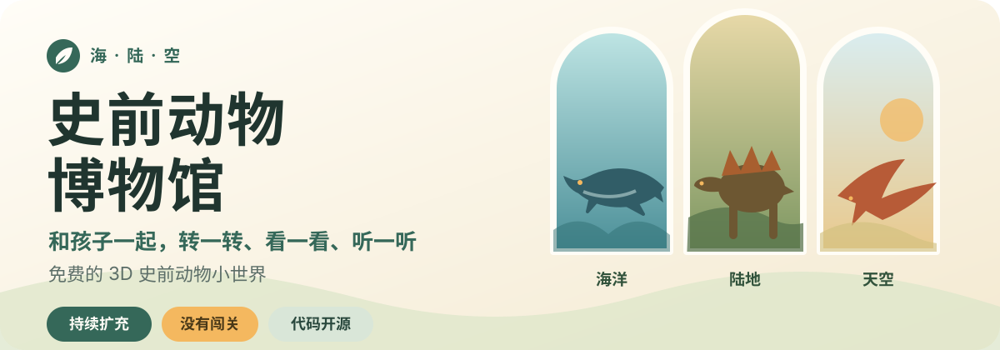

<p align="center">
  
</p>

<p align="center">
  <strong>给好奇的孩子，也给愿意陪在一旁一起看的大人。</strong><br>
  转动模型看看背板、牙齿和翅膀，想听时再播放普通话介绍。
</p>

<p align="center">
  <strong><a href="https://leon-made-this.work/museum">进入在线博物馆 →</a></strong>
  · <a href="README.md">English</a>
  · <strong>简体中文</strong>
</p>

<p align="center">打开就能用 · 无需注册 · 没有广告 · 不做访问统计 · 免费访问</p>
<p align="center">开源代码 · 非商业共享内容 · 品牌独立保护</p>

| 海 · 沧龙 | 陆 · 剑龙 | 空 · 古神翼龙 |
| :---: | :---: | :---: |
|  |  |  |

## 为什么做这座博物馆

女儿三岁时，看到电视里的恐龙会有点害怕。那些画面多半围绕追逐、对抗和“打败恐龙”，很少让孩子安静地看看这些动物本身。

我想给她一个没有输赢，也不会突然出现追逐和惊吓画面的地方。孩子可以选一只史前动物，换个角度观察，再听一段简短介绍；大人可以补充一句、问一个问题，也可以什么都不说，只陪着看。

这里不试图让孩子一直留在屏幕前。一次发现一个有趣的细节，就已经足够。

## 打开，就可以一起逛

1. 第一次打开建议使用 Wi-Fi；看到第一只动物和底部动物卡片出现，就可以开始了。
2. 让孩子挑一只感兴趣的史前动物，用手指或鼠标拖动模型，双指或滚轮放大、缩小。
3. 想听时再点“听介绍”；孩子问起细节，再打开“家长资料”。
4. 一次看两三只就很好，不必把整座博物馆逛完。

博物馆主要为 2～6 岁孩子设计，建议第一次探索时有大人陪在身边。年龄不是门槛；如果某个画面或声音让孩子不舒服，换一只动物或直接关掉就好。

## 18 种动物，来自海、陆、空

| 陆地 | 天空 | 海洋 |
| --- | --- | --- |
| 剑龙 | 无齿翼龙 | 鱼龙类 |
| 肿头龙 | 喙嘴翼龙 | 蛇颈龙类 |
| 霸王龙 | 古神翼龙 | 巨齿鲨 |
| 三角龙 | 巨脉蜻蜓 | 沧龙 |
| 迷惑龙 |  |  |
| 巨盗龙 |  |  |
| 长毛猛犸象 |  |  |
| 慈母龙 |  |  |
| 胄甲龙 |  |  |
| 双冠龙 |  |  |

“鱼龙类”和“蛇颈龙类”分别代表较大的动物类群，并不是某一个确定物种。化石没有留下全部答案，因此模型的颜色、软组织和部分动作属于基于现有证据的艺术复原；有争议或不确定的地方会在每只动物的家长资料中说明。

## 馆里可以做什么

- **自己观察**：18 个可以旋转、缩放的 3D 模型，分布在海洋、陆地和天空三个展区。
- **想听再听**：普通话旁白不会自动播放，每一段都经过人工审听。
- **一起找答案**：家长资料包含体型、年代、食性、科学说明和适合继续聊的问题。
- **舒服地使用**：支持手机、平板和桌面浏览器，也能用键盘操作，并尊重系统的“减少动态效果”设置。

## 不注册，也不追踪

- 不用登录，不建立用户档案，也不收集姓名、联系方式、设备标识或儿童信息。
- 没有广告，不做页面访问统计，不设置会员、知识解锁或付费门槛。
- 网页不会在使用过程中调用 AI、广告或分析服务；模型、图片和旁白都是预先准备好的静态内容。
- 博物馆可以免费访问；代码开源，原创博物馆内容允许非商业使用。

## 给开发者

### 在本地运行

需要 Node.js 20.19 或更新版本。

```sh
npm ci
npm run dev
```

<details>
<summary><strong>自定义本地主机与 GitHub Pages 路径</strong></summary>

如果要通过 Tailscale 等自定义域名访问本地 Vite 服务，请复制 `.env.example` 为 `.env.local`，并填写允许访问的主机名：

```dotenv
MUSEUM_ALLOWED_HOSTS=your-machine.example.ts.net,another-device.local
```

`.env.local` 不会被 Git 跟踪。不要把允许访问的主机改成任意地址。

如需模拟 GitHub Pages 的嵌套路径：

```sh
npm run build
node server.mjs dist --base /prehistoric-animal-museum/ --port 4173
```

然后打开 `http://127.0.0.1:4173/prehistoric-animal-museum/`。
</details>

### 提交前检查

```sh
npm run lint
npm run typecheck
npm test -- --run
npm run validate:content
npm run build
npm run test:e2e
```

如果本地保留着被 Git 忽略的候选素材，还可以运行专用评审模式：

```sh
npm run review
npm run test:review
```

### 为馆藏提供新候选

首轮公开验证期间，现有 18 种动物是正式馆藏。新的动物建议会先作为候选接受科学性、视觉、声音、儿童体验和再分发许可审查，不承诺立即加入公开版本。

开始前请阅读[动物包编写指南](ANIMAL_AUTHORING_GUIDE.md)；使用 Codex 等协作工具时，也可以参考[史前动物新增 Skill](.agents/skills/prehistoric-animal-onboarding/SKILL.md)。不要把未经审查的模型、原始素材或来源不明的文件直接放进正式馆藏。

贡献者保留自己原创贡献的著作权，提交贡献不代表把版权转让给项目方。代码贡献采用 AGPL-3.0-only；原创动物文案、旁白、背景和类似内容贡献采用 CC BY-NC-SA 4.0，并保留贡献者署名。提交 Pull Request 前请阅读[贡献指南](CONTRIBUTING.md)。

进一步的实现背景见[公开实现计划](PUBLIC_IMPLEMENTATION_PLAN.md)、[馆藏扩展计划](COLLECTION_EXPANSION_PLAN.md)和[开发进度记录](docs/development-progress.md)。

## 开源代码、非商业共享内容、品牌独立保护

这个仓库采用分层许可：

- 软件代码是真正的开源软件，采用 [GNU AGPL-3.0-only](LICENSE)，允许商业使用；修改后通过网络提供服务时，必须按许可证提供对应源代码。
- 项目方或贡献者拥有权利的原创科普文字、旁白、展厅背景和类似内容采用 [CC BY-NC-SA 4.0](LICENSES/CC-BY-NC-SA-4.0.txt)，须署名、相同方式共享，不授予商业使用权。
- 贡献者保留其原创贡献的著作权，不发生默认版权转让；未经贡献者另行同意，项目方不能把其贡献单方面改成专有许可或独立商业许可。
- “Leon 做了个 / Leon Made This”、项目名称、标志及用于识别官方来源的品牌元素独立保护，只用于防止冒充官方；改名、替换品牌后的 Fork 和正常二次开发不受妨碍，详见[品牌政策](BRAND_POLICY.md)。
- 第三方库、字体、3D 模型和混合素材继续遵守各自许可，并保留作者、来源、许可和修改记录。

完整适用范围见[许可说明](LICENSING.md)，贡献方式见[贡献指南](CONTRIBUTING.md)，品牌边界见[品牌政策](BRAND_POLICY.md)。素材来源、修改记录和分发说明见 [THIRD_PARTY_NOTICES.md](THIRD_PARTY_NOTICES.md)，以及每个动物包内的 `provenance/LICENSES/`。
